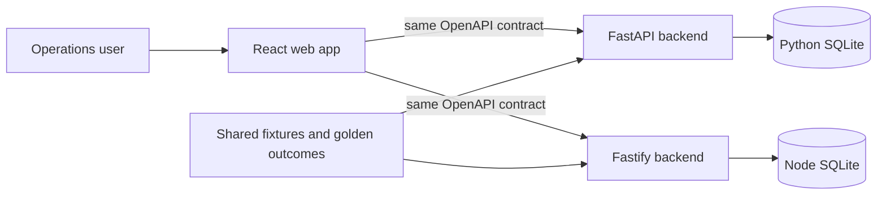
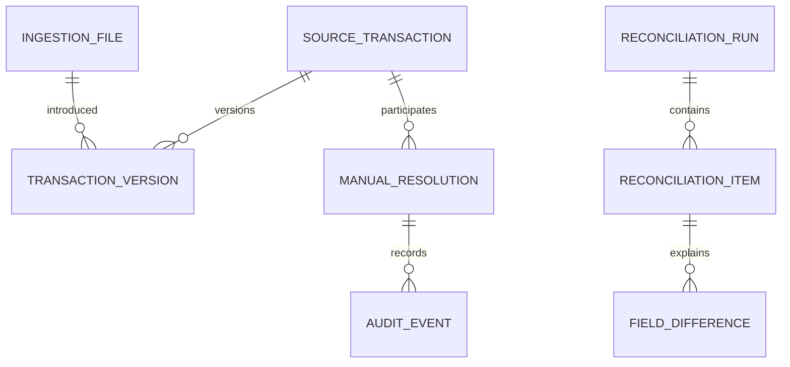
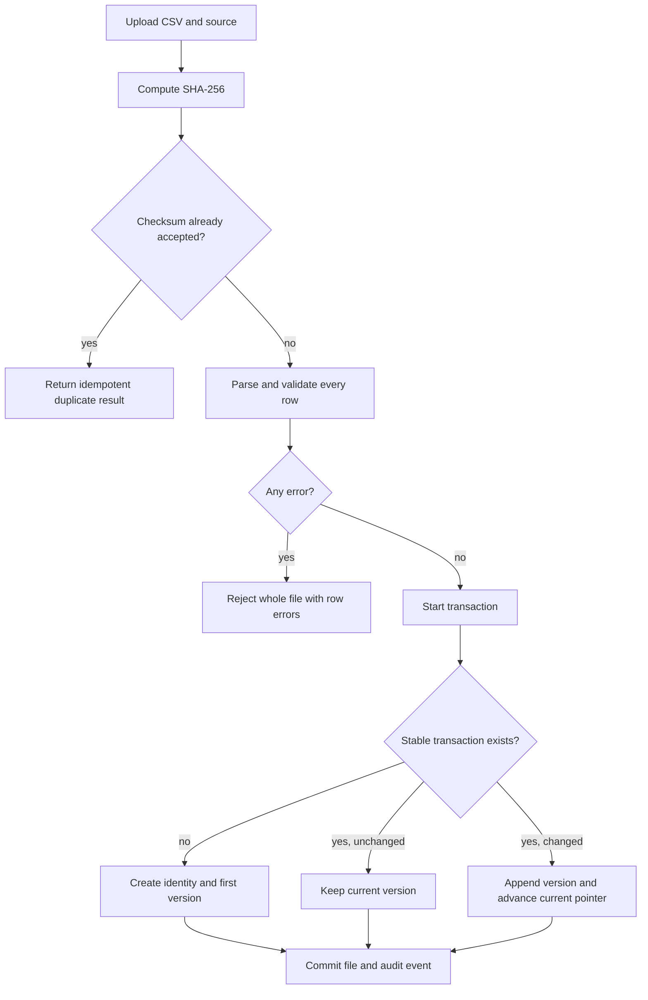
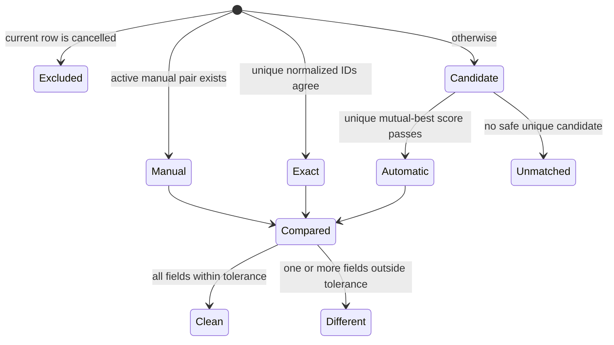

# Architecture

## Goals and constraints

The system must ingest two independently designed CSV formats, retain corrections, produce reproducible reconciliation runs, explain every automatic decision, and preserve manual decisions. The same public behavior is implemented independently in Python and Node. SQLite keeps reviewer setup small; the shared API contract and fixtures keep the implementations aligned.

Non-goals are authentication, asynchronous processing, multi-tenancy, production file storage, and probabilistic or machine-learned matching.

## System context

The frontend is backend-agnostic. The databases are intentionally independent: parity is established through behavior, not shared state or shared domain implementation.

## Canonical transaction

Every adapter produces the same immutable value object: source, source transaction ID, UTC execution time, uppercase instrument, BUY/SELL side, decimal quantity, decimal unit price, decimal gross amount, SETTLED/CANCELLED state, and the original row. Decimal values cross the API as strings.

## Core entities

`source_transactions` provide stable identity. `transaction_versions` are immutable and the stable record points to the current version. Run items reference the exact versions used, making old runs reproducible. Tolerances are snapshotted as JSON on each run.

## Ingestion and correction lifecycle

Omitted rows remain active because files are versioned upserts rather than complete snapshots. Cancelled rows remain queryable but do not participate in matching.

## Matching and reconciliation

Matching is deterministic:

1. Reapply active manual decisions by stable transaction identity.
2. Pair unique normalized source IDs.
3. Gate remaining candidates on identical instrument and side, time delta at most 15 minutes, quantity relative delta at most 0.1%, and gross relative delta at most 1%.
4. Score eligible candidates as `0.50*timeCloseness + 0.25*quantityCloseness + 0.25*grossCloseness`, with each closeness normalized against its gate.
5. Accept only mutual-best pairs scoring at least 0.75. Equal scores are ambiguous and remain unmatched.

Comparisons use 120 seconds for time, `0.00000001` absolute for quantity, and the greater of `0.01` absolute or `0.01%` relative for price and gross. Text enums compare exactly after normalization.

## Resolutions and auditability

Manual pairs and accepted-unmatched decisions use stable transaction identities and therefore survive corrected versions. A transaction can have only one active resolution. Changes supersede prior rows rather than deleting them. If a transaction becomes cancelled, its resolution is retained but dormant. Every upload, run, and resolution writes an audit event using the local demo actor.

## API and error strategy

`shared/openapi/openapi.yaml` is the public contract. Both services return UTC ISO timestamps, decimal strings, the same enums, and `{error: {code, message, details}}` failures. Validation completes before database mutation. Unexpected failures become generic 500 responses and retain internal diagnostic context in server logs.

## Implementation mapping

| Concern | Python | Node |
|---|---|---|
| HTTP | FastAPI | Fastify |
| Persistence | SQLAlchemy 2 | Knex |
| Migrations | Alembic | Knex migrations |
| Decimal math | `decimal.Decimal` | `decimal.js` |
| Validation | Pydantic | JSON Schema / TypeBox-style schemas |
| Tests | pytest | Node test runner |

Neither backend imports reconciliation code from the other. Only the contract, fixture files, and expected outcomes are shared.

### Readability conventions

Domain functions remain database-independent and use domain names rather than persistence terminology. Comments explain financial precision, candidate safety, versioning, and snapshot behavior; routine framework wiring is kept self-explanatory instead of being narrated line by line. Both implementations are auto-formatted and use small helpers at validation, persistence, and matching boundaries.

## Testing strategy

Unit tests exercise normalization, decimal tolerances, exact matching, candidate scoring, ambiguity, cancellation, and ordering without HTTP or SQLite. Integration tests cover atomic uploads, checksum idempotency, corrections, snapshots, resolutions, and auditing. The conformance runner seeds both services with the same fixtures and compares normalized API outcomes. The React workflow is designed to run unchanged against either API.

## Security and production readiness

The take-home accepts local CSV files and has no authentication. Production work would add size and content limits, antivirus scanning, durable object storage, authorization, secrets management, rate limiting, database concurrency controls, structured observability, backup/retention policy, and background workers.

## Decision log

| Decision | Reason |
|---|---|
| Python is the primary demo | Makes the learning outcome visible while retaining the author's strongest-stack comparison. |
| Separate SQLite databases | Reviewer-friendly setup and independent proof of persistence behavior. |
| Contract-first API | Prevents frontend forks and makes parity measurable. |
| Versioned upserts | Corrections preserve history without assuming every file is a complete snapshot. |
| Conservative deterministic matching | Financial reconciliation must favor explainability over coverage. |
| Synchronous runs | Appropriate for generated take-home data; background jobs are operational scope. |
