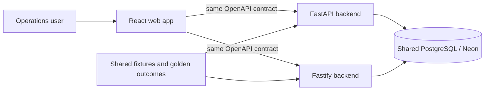
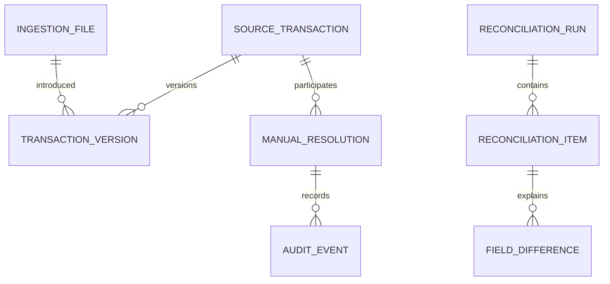
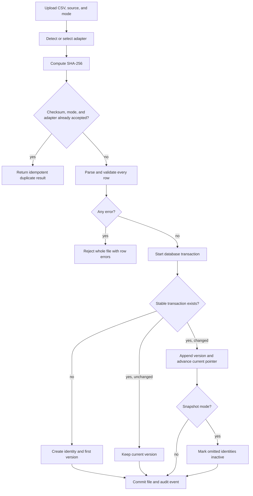
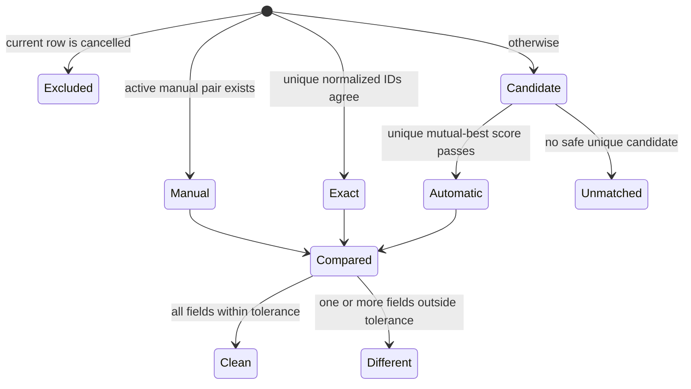
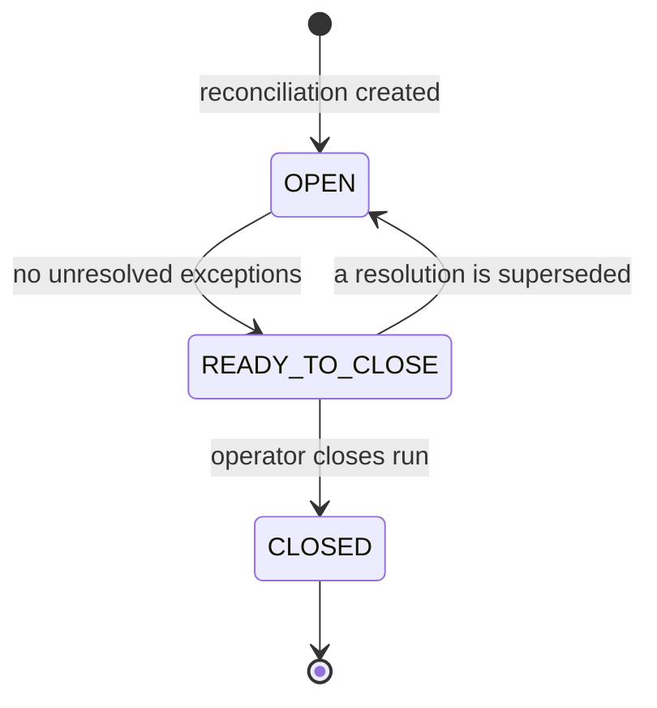

# Architecture

## Goals and constraints

The system must ingest independently designed CSV formats, retain corrections, produce reproducible reconciliation runs, explain every automatic decision, and preserve manual decisions. The same public behavior is implemented independently in Python and Node. Both services use one PostgreSQL schema so operational history is shared; the API contract and fixtures keep their behavior aligned.

Non-goals are authentication, asynchronous processing, multi-tenancy, production file storage, and probabilistic or machine-learned matching.

## System context

The frontend is backend-agnostic. Python is the schema owner through Alembic and SQLAlchemy. Node uses Knex to query the same schema and verifies the Alembic version at startup; it does not run a second migration history.

## Canonical transaction

Every adapter produces the same immutable value object: source, source transaction ID, UTC execution time, uppercase instrument, BUY/SELL side, decimal quantity, decimal unit price, decimal gross amount, SETTLED/CANCELLED state, and the original row. Decimal values cross the API as strings.

## Core entities

`source_transactions` provide stable identity. `transaction_versions` are immutable and the stable record points to the current version. A run item's JSONB result embeds the exact version IDs and normalized values used, making old runs reproducible. Tolerances are snapshotted as JSONB on each run.

## Ingestion and correction lifecycle

Incremental uploads are versioned upserts, so omitted rows remain active. Snapshot uploads represent the complete current source and mark omitted identities inactive without confusing absence with an explicit cancellation. A later appearance creates a new version and reactivates the identity. Cancelled and inactive rows remain queryable but do not participate in matching.

### Adapter boundary

The logical source remains `LEDGER` or `COUNTERPARTY`; a physical file format is selected independently. Registered adapters declare source compatibility, required header signatures, and normalization behavior. Straight column renames use declarative mappings, while complex conversions use small code adapters. Auto-detection must resolve to exactly one adapter unless the request supplies an explicit override. Extra columns are retained in raw JSONB.

## Matching and reconciliation

Matching is deterministic:

1. Reapply active manual decisions by stable transaction identity.
2. Pair unique normalized source IDs.
3. Gate remaining candidates on identical instrument and side, time delta at most 15 minutes, quantity relative delta at most 0.1%, and gross relative delta at most 1%.
4. Score eligible candidates as `0.50*timeCloseness + 0.25*quantityCloseness + 0.25*grossCloseness`, with each closeness normalized against its gate.
5. Accept only mutual-best pairs scoring at least 0.75. Equal scores are ambiguous and remain unmatched.

Comparisons use 120 seconds for time, `0.00000001` absolute for quantity, and the greater of `0.01` absolute or `0.01%` relative for price and gross. Text enums compare exactly after normalization.

## Resolutions and auditability

Manual pairs, accepted-unmatched decisions, and accepted-difference decisions use stable transaction identities and therefore survive corrected versions. A transaction can have only one active resolution of a given purpose. Changes supersede prior rows rather than deleting them. If a transaction becomes cancelled or inactive, its resolution is retained but dormant. Every upload, run, resolution, and closure writes an audit event using the local demo actor.

`DIFFERENT`, ledger-unmatched, and counterparty-unmatched items are review exceptions. A run becomes ready only after every exception has an active decision. Closed runs and their item snapshots are immutable; subsequent uploads always produce a new run.

Changed uploads are rejected while a run is open. Exact duplicate uploads remain harmless no-ops. This prevents a manual action from rebuilding an open run against transaction versions different from its original snapshot.

## API and error strategy

`shared/openapi/openapi.yaml` is the public contract. Both services return UTC ISO timestamps, decimal strings, the same enums, and `{error: {code, message, details}}` failures. Validation completes before database mutation. Unexpected failures become generic 500 responses and retain internal diagnostic context in server logs.

The runtime `DATABASE_URL` may use Neon's pooler. Alembic alone receives `DIRECT_URL`; the Node service checks the `alembic_version` table and fails fast rather than attempting its own migrations. Reset tooling permits local hosts by default and refuses hosted targets unless an explicit override is supplied.

## Implementation mapping

| Concern | Python | Node |
|---|---|---|
| HTTP | FastAPI | Fastify |
| Persistence | SQLAlchemy 2 | Knex with `pg` |
| Migrations | Alembic (schema owner) | Alembic-version check only |
| Decimal math | `decimal.Decimal` | `decimal.js` |
| Validation | Pydantic | JSON Schema / TypeBox-style schemas |
| Tests | pytest | Node test runner |

Neither backend imports reconciliation code from the other. Only the contract, fixture files, and expected outcomes are shared.

### Readability conventions

Domain functions remain database-independent and use domain names rather than persistence terminology. Comments explain financial precision, candidate safety, versioning, and snapshot behavior; routine framework wiring is kept self-explanatory instead of being narrated line by line. Both implementations are auto-formatted and use small helpers at validation, persistence, and matching boundaries.

## Testing strategy

Unit tests exercise normalization, decimal tolerances, exact matching, candidate scoring, ambiguity, cancellation, and ordering without HTTP or PostgreSQL. Integration tests use a disposable PostgreSQL database and cover atomic uploads, checksum idempotency, corrections, snapshots, resolutions, closure, and auditing. Both services are also held to one shared expectations file over the extended fixture week. The conformance runner resets that test database between implementations and compares normalized API outcomes. The React workflow is designed to run unchanged against either API.

## Security and production readiness

The take-home accepts local CSV files and has no authentication. Production work would add size and content limits, antivirus scanning, durable object storage, authorization, secrets management, rate limiting, database concurrency controls, structured observability, backup/retention policy, and background workers.

## Decision log

| Decision | Reason |
|---|---|
| Python is the primary demo | Makes the learning outcome visible while retaining the author's strongest-stack comparison. |
| Shared PostgreSQL database | Both APIs expose one operational history and match the intended hosted Neon runtime. |
| Alembic is the only migration owner | Python remains primary and competing migration histories cannot race on shared tables. |
| Knex remains the Node persistence layer | The secondary backend needs readable typed queries, not an additional ORM. |
| Contract-first API | Prevents frontend forks and makes parity measurable. |
| Explicit incremental or snapshot uploads | Corrections preserve history while complete extracts can intentionally retire omissions. |
| Hybrid adapter registry | Simple mappings stay declarative and complex source rules remain testable code. |
| Explicit run closure | A flagged exception always ends with a durable human decision. |
| Conservative deterministic matching | Financial reconciliation must favor explainability over coverage. |
| Synchronous runs | Appropriate for generated take-home data; background jobs are operational scope. |
