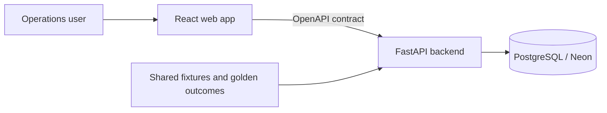
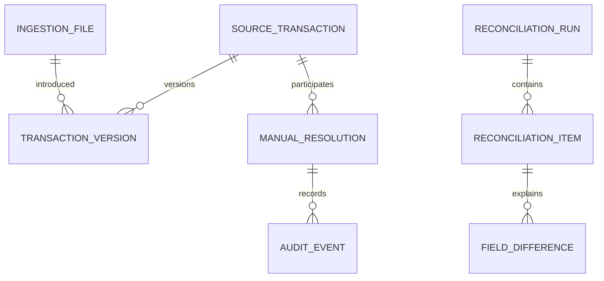
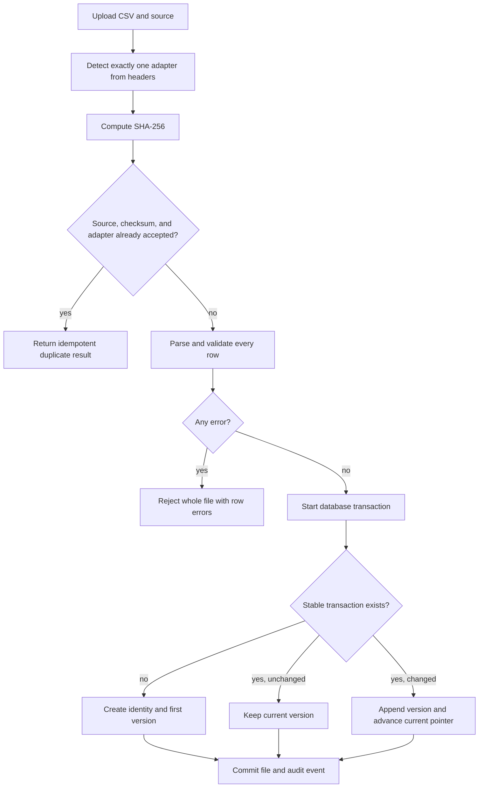
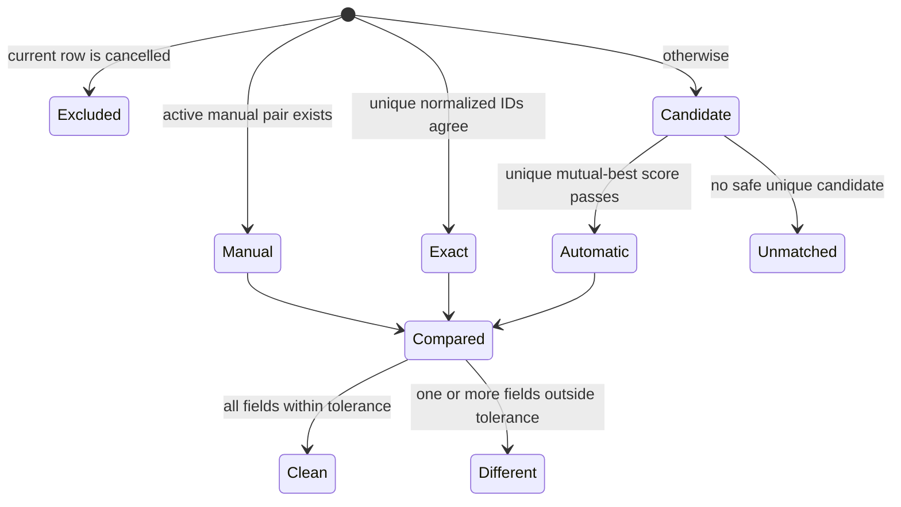
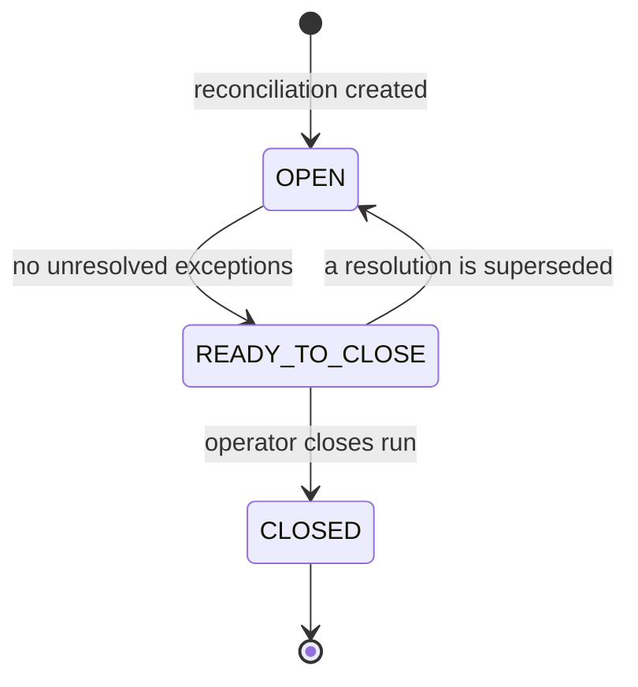

# Architecture

## Goals and constraints

The system must ingest independently designed CSV formats, retain corrections, produce reproducible reconciliation runs, explain every automatic decision, and preserve manual decisions.

Non-goals are authentication, asynchronous processing, multi-tenancy, production file storage, and probabilistic or machine-learned matching.

## System context

Python is the schema owner through Alembic and SQLAlchemy.

## Canonical transaction

Every adapter produces the same immutable value object: source, source transaction ID, UTC execution time, uppercase instrument, BUY/SELL side, decimal quantity, decimal unit price, decimal gross amount, SETTLED/CANCELLED state, and the original row. Decimal values cross the API as strings.

## Core entities

`source_transactions` provide stable identity. `transaction_versions` are immutable and the stable record points to the current version. A run item's JSONB result embeds the exact version IDs and normalized values used, making old runs reproducible. Tolerances are snapshotted as JSONB on each run.

## Ingestion and correction lifecycle

Every upload is a versioned upsert. Omitted rows remain available, unchanged rows create no new
version, and corrected normalized values append an immutable version. Explicitly cancelled rows
remain queryable but do not participate in matching.

### Adapter boundary

The logical source remains `LEDGER` or `COUNTERPARTY`. The adapter registry is internal: registered
adapters declare source compatibility, header signatures, and normalization behavior. Each upload
must match exactly one adapter for its selected source; unsupported or ambiguous headers reject the
whole file. Straight column renames use declarative mappings, while complex conversions use small
code adapters. Extra columns are retained in raw JSONB, and the detected adapter ID is retained in
database and audit metadata as format provenance without being exposed as an operator choice.

## Matching and reconciliation

Matching is deterministic:

1. Reapply active manual decisions by stable transaction identity.
2. Pair unique normalized source IDs.
3. Gate remaining candidates on identical instrument and side, time delta at most 15 minutes, quantity relative delta at most 0.1%, and gross relative delta at most 1%.
4. Score eligible candidates as `0.50*timeCloseness + 0.25*quantityCloseness + 0.25*grossCloseness`, with each closeness normalized against its gate.
5. Accept only mutual-best pairs scoring at least 0.75. Equal scores are ambiguous and remain unmatched.

Comparisons use 120 seconds for time, `0.00000001` absolute for quantity, and the greater of `0.01` absolute or `0.01%` relative for price and gross. Text enums compare exactly after normalization.

## Resolutions and auditability

Manual pairs, accepted-unmatched decisions, and accepted-difference decisions use stable transaction identities and therefore survive corrected versions. A transaction can have only one active resolution of a given purpose. Changes supersede prior rows rather than deleting them. If a transaction becomes cancelled, its resolution is retained but dormant. Every upload, run, resolution, and closure writes an audit event using the local demo actor.

`DIFFERENT`, ledger-unmatched, and counterparty-unmatched items are review exceptions. A run becomes ready only after every exception has an active decision. Closed runs and their item snapshots are immutable; subsequent uploads always produce a new run.

Only one run may be open (`OPEN` or `READY_TO_CLOSE`) at a time: `POST /api/runs` rejects a
new run with `OPEN_RUN_EXISTS` while one exists, and the UI disables "Start run" the same way.
Changed uploads are rejected while a run is open, for the same reason: this prevents a manual
action from rebuilding an open cycle against transaction versions different from those it began
with. Exact duplicate uploads remain harmless no-ops. A later run uses every stored transaction's
latest version and reapplies active manual decisions; closed runs retain their embedded results as
immutable history. Runs have no business-date field and do not imply a calendar day.

## API and error strategy

`shared/openapi/openapi.yaml` is the public contract: UTC ISO timestamps, decimal strings, and `{error: {code, message, details}}` failures. Validation completes before database mutation. Unexpected failures become generic 500 responses and retain internal diagnostic context in server logs.

The runtime `DATABASE_URL` may use Neon's pooler. Alembic alone receives `DIRECT_URL`. Reset tooling permits local hosts by default and refuses hosted targets unless an explicit override is supplied.

### Readability conventions

Domain functions remain database-independent and use domain names rather than persistence terminology. Comments explain financial precision, candidate safety, and versioning; routine framework wiring is kept self-explanatory instead of being narrated line by line. The implementation is auto-formatted and uses small helpers at validation, persistence, and matching boundaries.

## Testing strategy

Unit tests exercise normalization, format detection, decimal tolerances, exact matching, candidate scoring, ambiguity, cancellation, and ordering without HTTP or PostgreSQL. Integration tests use a disposable PostgreSQL database and cover atomic uploads, checksum idempotency, incremental corrections and omissions, resolutions, closure, and auditing, and are held to one shared expectations file over the extended fixture set.

## Security and production readiness

The take-home accepts local CSV files and has no authentication. Production work would add size and content limits, antivirus scanning, durable object storage, authorization, secrets management, rate limiting, database concurrency controls, structured observability, backup/retention policy, and background workers.

## Decision log

| Decision | Reason |
|---|---|
| Python/FastAPI API with Alembic migrations | Keeps one clear schema owner and migration history. |
| Contract-first API | Keeps the frontend decoupled from server implementation details. |
| Only one run open at a time | Keeps the current review cycle unambiguous and prevents changed uploads from altering it. |
| Automatic incremental ingestion | Operators select only a source and CSV; omissions remain available and corrections preserve history. |
| Hybrid adapter registry | Simple mappings stay declarative and complex source rules remain testable code. |
| Explicit run closure | A flagged exception always ends with a durable human decision. |
| Conservative deterministic matching | Financial reconciliation must favor explainability over coverage. |
| Synchronous runs | Appropriate for generated take-home data; background jobs are operational scope. |
